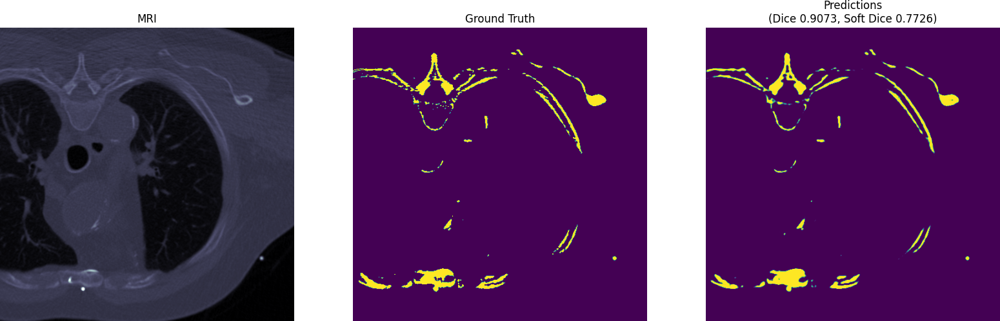

# 2D U-Net for Medical AIC Project Dataset

Identifying rare but significant healthcare events in massive unstructured datasets has become a common task in healthcare data analytics. However, imbalanced class distribution in many practical datasets greatly hampers the detection of rare events, as most classification methods implicitly assume an equal occurrence of classes and are designed to maximize the overall classification accuracy.

When using the magna valve dataset, it occur that a lot of images were everything except the valve in itself.
Leading to a lot of 0 for the training.
To overcome this problem, using statistical analysis, the dataset was crop in x,y and z leading to processing images from (512,512) to (312,312) and keeping only 75% of the all scan in z.

In order to reproduce results, these following steps need to be done
## "Step 1 of 3: Use Viewer to extract labels from dicom files"

Because data from Dicom files were given without annotation, Viewer served as a platform for manually defined area for valve detection
## "Step 2 of 3: Use Dataloader Generator from TensorFlow and Train U-Net on dataset"

```
python train_dataloader.py
```

## "Step 3 of 3: Run sample inference script"
```
python plot_inference_examples.py 
```

## Results from Predictions

