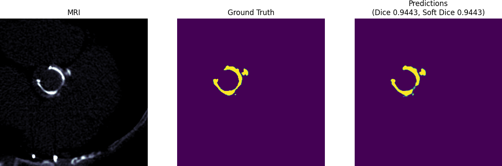

# 2D U-Net for Medical AIC Project Dataset

In order to reproduce results, these following steps need to be done
## "Step 1 of 3: Use Viewer to extract labels from dicom files"

Because data from Dicom files were given without annotation, Viewer served as a platform for manually defined area for valve detection
## "Step 2 of 3: Use Dataloader Generator from TensorFlow and Train U-Net on dataset"

```
python train_dataloader.py
```

## "Step 3 of 3: Run sample inference script"
```
python plot_inference_examples.py 
```

## Results from Predictions

