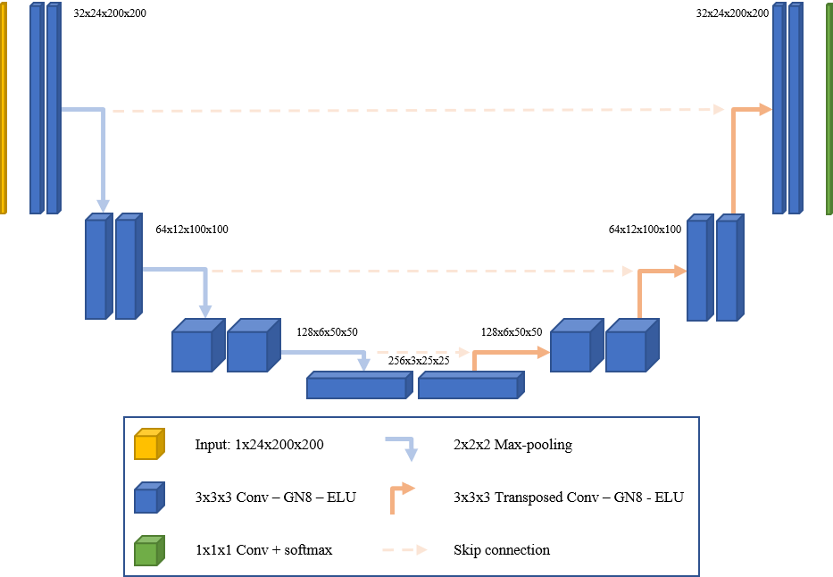

# Project_AIC

This project use State-of-the-Art Deep learning method to estimate the Agatston score.
This score is a score based on the extent of coronary artery calcification detected by an unenhanced low-dose CT scan, which is routinely performed in patients undergoing cardiac CT. Due to an extensive body of research, it allows for early risk stratification as patients with a high Agatston score (>160) have an increased risk for a major adverse cardiac event (MACE) 2. Although it does not allow for the assessment of soft non-calcified plaques, it has shown a good correlation with contrast-enhanced CT coronary angiography 1. 

## Method of calculation
The calculation is based on the weighted density score given to the highest attenuation value (HU) multiplied by the area of the calcification speck.

### Density factor
130-199 HU: 1
200-299 HU: 2
300-399 HU: 3
400+ HU: 4

For example, if a calcified speck has a maximum attenuation value of 400 HU and occupies 8 sq mm area, then its calcium score will be 32.
The score of every calcified speck is summed up to give the total calcium score.  

Grading of coronary artery disease (based on total calcium score)
no evidence of CAD: 0 calcium score
minimal: 1-10
mild: 11-100
moderate: 101-400
severe: >400
Guidelines for coronary calcium scoring by 2010 ACCF task force
These guidelines are latest at time of writing (July 2016):

## Deep Learning Architecture (2D and 3D)

The U-Net is a convolutional neural network architecture that is designed for fast and precise segmentation of images. It has performed extremely well in several challenges and to this day, it is one of the most popular end-to-end architectures in the field of semantic segmentation.
The network into two parts: The encoder path (backbone) and the decoder path. The encoder captures features at different scales of the images by using a traditional stack of convolutional and max pooling layers. Concretely speaking, a block in the encoder consists of the repeated use of two convolutional layers (k=3, s=1), each followed by a non-linearity layer, and a max-pooling layer (k=2, s=2). For every convolution block and its associated max pooling operation, the number of feature maps is doubled to ensure that the network can learn the complex structures effectively.
The decoder path is a symmetric expanding counterpart that uses transposed convolutions. This type of convolutional layer is an up-sampling method with trainable parameters and performs the reverse of (down)pooling layers such as the max pool. Similar to the encoder, each convolution block is followed by such an up-convolutional layer. The number of feature maps is halved in every block. Because recreating a segmentation mask from a small feature map is a rather difficult task for the network, the output after every up-convolutional layer is appended by the feature maps of the corresponding encoder block. The feature maps of the encoder layer are cropped if the dimensions exceed the one of the corresponding decoder layers.
In the end, the output passes another convolution layer (k=1, s=1) with the number of feature maps being equal to the number of defined labels. The result is a u-shaped convolutional network that offers an elegant solution for good localization and use of context. Let’s take a look at the code.

## Project Architecture

The project is made of three subfolders
- Viewer
- AI_2D
- AI_3D
## Render

The Viewer section uses The Visualization Toolkit (VTK). It is an open source software for manipulating and displaying scientific data. It comes with state-of-the-art tools for 3D rendering, a suite of widgets for 3D interaction, and extensive 2D plotting capability.

## AI_2D

Implementation of U-Net Architecture by using 2D slices and using Tensorflow 2.X and Dataloader 

## AI_3D

Implementation of U-Net Architecture by using 3D volumes and using Tensorflow 2.X and Dataloader
